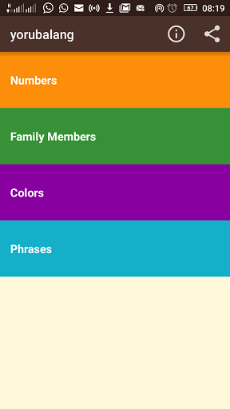
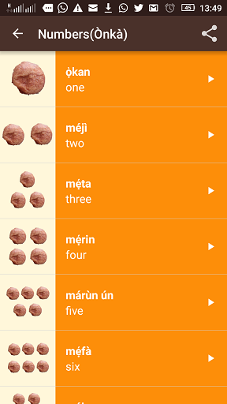
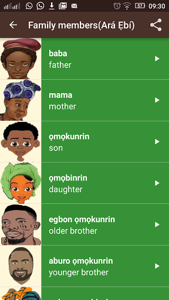
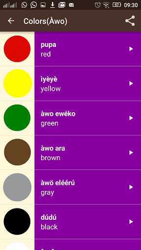
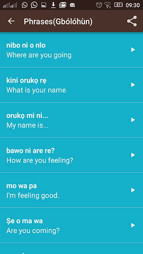
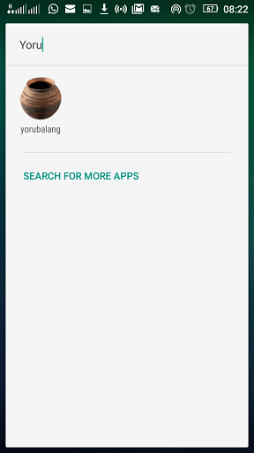

# yorubalang

This app provides English to Yoruba translation for basic & common Yoruba words and phrases use daily.

[google_link](www.google.com){:target="_blank"} 
# Classes
This project have 5 java classes
1. AboutActivity
2. HomeActivity
3. FamilyActivity
4. ColorActivity
5. PhrasesActivity
6. NumbersActivity

# Layouts
This project have 7  major Layouts
1. About Layout
2. Home Layout
3. FamilyActivity
4. ColorActivity
5. PhrasesActivity
6. NumbersActivity

# Click on Google Drive Icon Below to download apk

# Screenshots
&nbsp;
&nbsp;
&nbsp;
&nbsp;
&nbsp;

# Author : Alabi Temitope 
